# 카카오 로그인하기
자바스크립트를 이용하여 카카오 계정 로그인하는 방법에 대해서 학습해 보도록 합니다.  

API 서비스를 이용하면 별도의 회원가입을 받지 않고 카카오나 페이스북이나 구글 같은 sns 계정을 통해서 로그인을 자동으로 처리 할 수 있습니다.


## 카카오 개발자 가입하기

developers.kakao.com 에 접속하여 개발자 가입을 합니다.

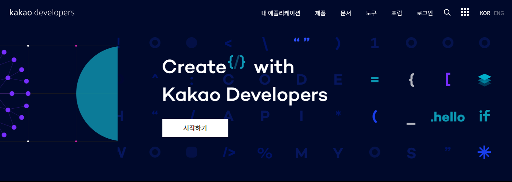


회원 로그인을 합니다.

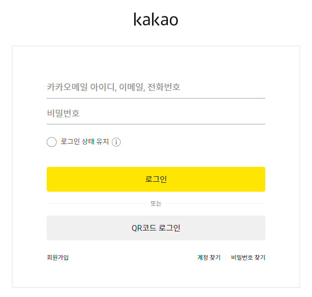


## 애플리케이션 등록 및 설정

상단 메뉴에서 `내 애플리케이션` 메뉴를 클릭하여 개발할 어플리케이션을 추가합니다.

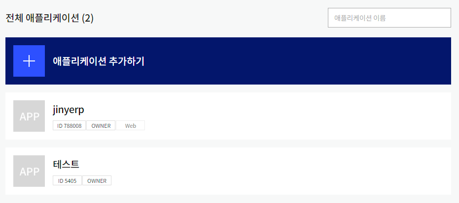


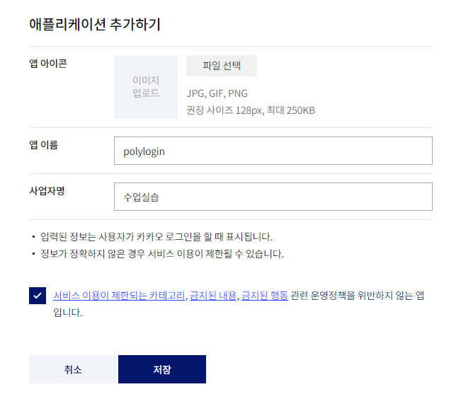

### api 키 확인

추가한 앱을 선택합니다. API 접속을 위한 다양한 키가 생성된 것을 확인할 수 있습니다.

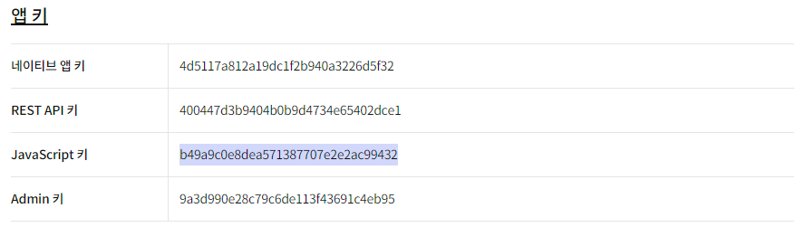

별도로 `javascript` 연동을 위한 키가 생성된 것을 볼 수 있습니다. 


### 플렛폼 등록하기

선택한 어플리케이션 페이지 하단에 보면 플렛폼 등록하기가 있습니다.


Web 플렛폼 등록을 선택합니다.

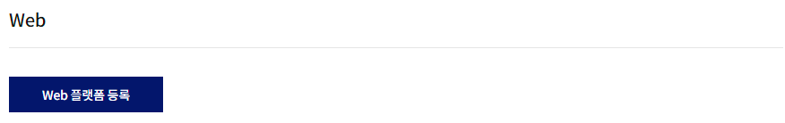

테스트 개발을 위하여 localhost를 이용합니다. 서비스를 진행할 때에는 실제 도메인 주소를 입력해 주어야 합니다.


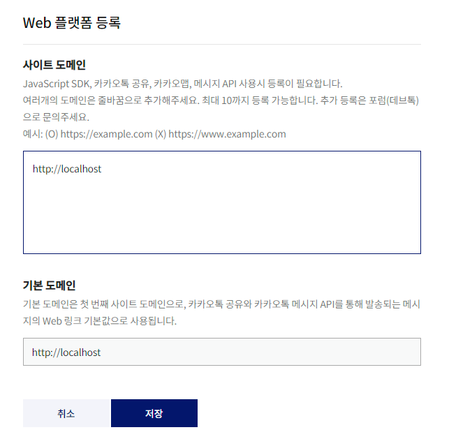


만일 80포트가 아닌 다른 번호를 사용하는 경우 이를 같이 추가합니다.


### 리다이렉션 url 등록

카카오 로그인을 하기 위해서는 redirect url을 추가해 주어야 합니다.


먼저 카카오 로그인을 `활성화` 합니다.

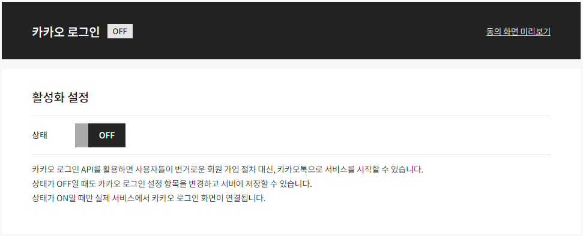


리다이렉션 url을 등록합니다.

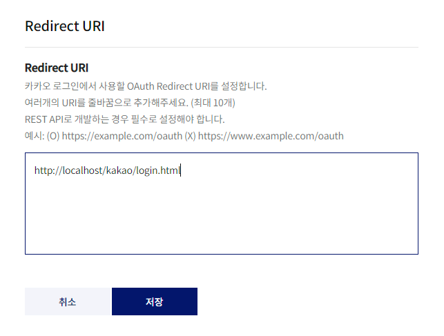

설정한 값을 확인합니다.

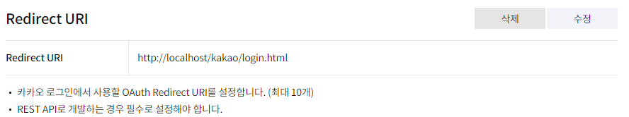


### 설정

오른쪽 `제품설정` 메뉴를 확인합니다. 카카오 로그인 `동의항목`을 선택합니다.  

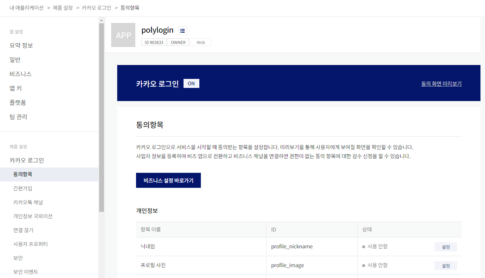

필요한 항목들을 선택하여 설정을 합니다.

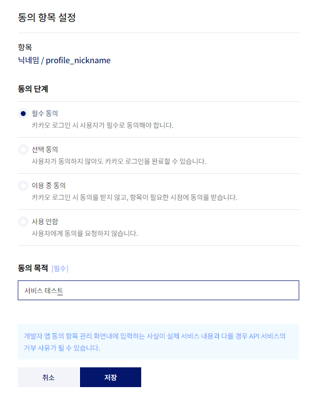


## 코드작성

카카오 서비스를 하용하기 위해서는 추가 자바스크립트 코드를 삽입해 주어야 합니다. 

```js
<script src="https://developers.kakao.com/sdk/js/kakao.js"></script>
```


로그인 html 코드를 작성합니다.

```html
<!DOCTYPE html>
<html lang="en">
<head>
    <meta charset="UTF-8">
    <meta http-equiv="X-UA-Compatible" content="IE=edge">
    <meta name="viewport" content="width=device-width, initial-scale=1.0">
    <title>Kakao Login api</title>
</head>
<body>
    <a href="javascript:kakaoLogin();">카카오 로그인</a>

    <script src="https://developers.kakao.com/sdk/js/kakao.js"></script>
    <script>
        window.kako.init("b49a9c0e8dea571387707e2e2ac99432"); // api키 초기화
        function kakoLogin() {
            window.kako.Auth.login({
                scope: 'profile, acount_email', // 동의항목에서 설정한 id
                success: function(authObj){
                    console.log(authObj);
                    window.kako.API.request({
                        url:'/v2/user/me',
                        success: res => {
                            const kakao_account = res.kakao_account;
                            console.log(kakao_account);
                        }
                    });
                }
            });
        }

    </script>
</body>
</html>
```


