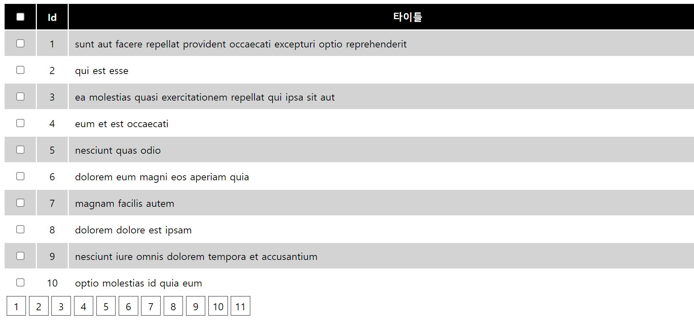
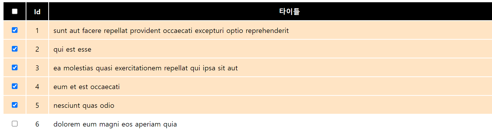
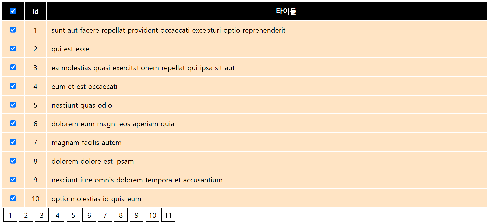

# 기말고사 및 평가기준

## 01.프로그램 실습(25점)
드래그가 가능한 테이블을 제작합니다. 

### 테이블 목록 출력 (5)

fetch 함수를 이용하여 `forum.json` 파일을 읽어서 테이블로 출력합니다.

### 홀수/짝수 배경색 다르게 표시 (5)

홀수 라인과 짝수라인을 다른 색으로 표시합니다. 드래그를 위하여 체크가 된경우 
체크된 색상이 우선적용됩니다.

### 페이지네이션. 페이지10개씩 표시 클릭시 이동 (5)
103개의 데이터를 10개씩 페이지 네이션을 구현합니다. 각 페이지 마다 내용이 이동합니다.
마지막 페이지는 3개만 표시됩니다.

### 체크박스 선택된 것만 드래그 가능 (5)
체크박스 선택시 한줄이 드래그 가능하도록 선택됩니다.
선택시 색상이 변경됩니다.
다른 페이지로 이동시 선택은 삭제됩니다.

### 전체 선택가능 및 드래그 기능 (5)
전체 선택시 하위 모든 항목이 체크됩니다.
체크된 항목은 드래그 이동이 가능합니다.
다른 페이지로 이동시 선택이 해제됩니다.

## 02. 과제평가(25점)
- 계층별 레이아웃 정리 및 구현 : 2점 (단순 구현 1점, 계층구현 2점)
- flex 레이아웃 구현 : 2점 (단순구현 1점, 중첩구현 2점)
- 부분별 모듈 정리 및 include : 2점 (단순구현 1점, 중첩구현 2점)
- json 데이터 활용 : 3점 (데이터 파일 1개활마다 1점, 최대 3점)
- 깃허브 및 사이트 배포 : 2점 
- 지속적인 개발 : 매일 커밋 1회 ( +1점씩) 총 10점
- 자체 CSS 코드 작성 : 2점 ( 선택방식 5종 이하 1점, 5종이상 2점)
- 자체 javascript 코드 작성 : 2점 (100줄 이하 1점, 200줄 이상 2점)

## 03. HTML 객관식(25점)
- 문제 50문제

## 04. Javascript 객관식(25점)
- 문제 45문제

