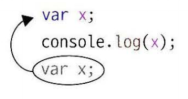
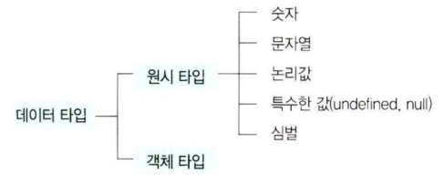
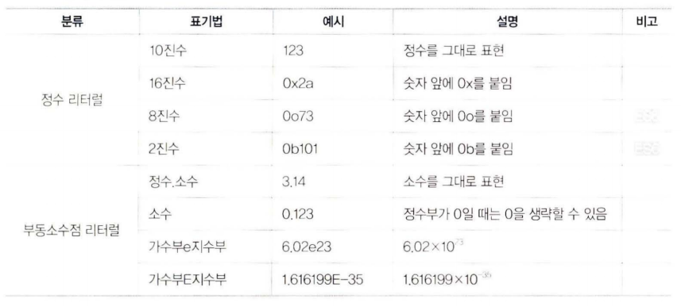
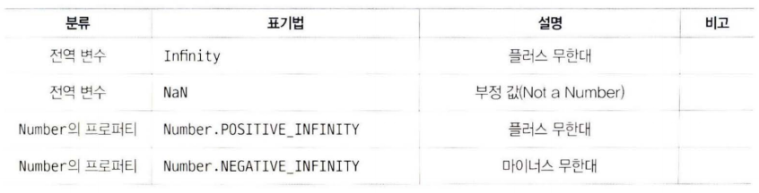
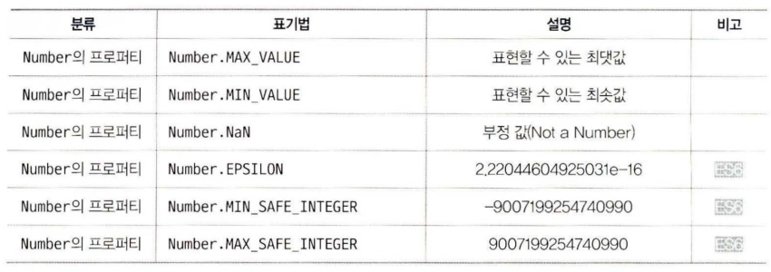
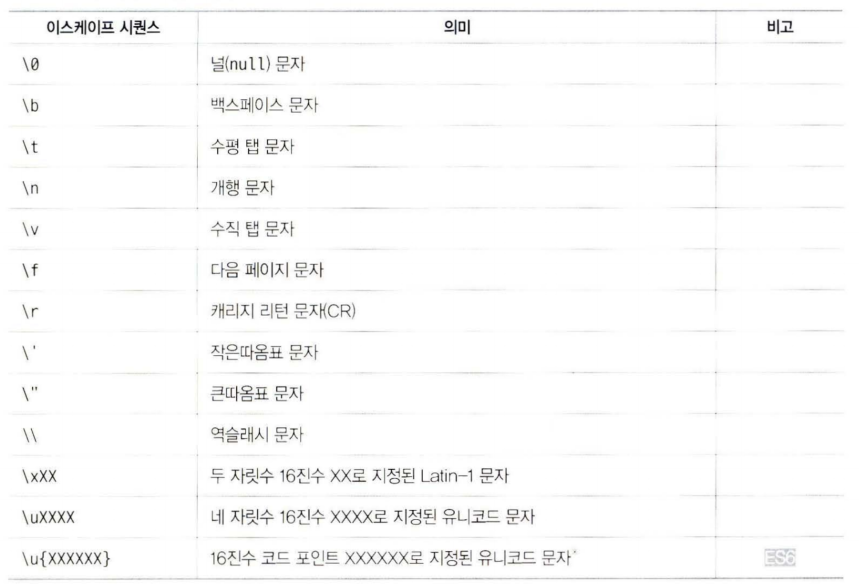

# 변수와 값


## 변수
자바스크립트에서 변수를 선언하는 방법과 변수 이름을 짓는 방법을 배웁니다.

### 변수란?
변수는 값을 담기 위한 저장공간 입니다.

### 변수 선언
ES5 버젼의 자바스크립트에서는 변수의 선언을 `var` 키워드를 통하여 선언합니다.

```js
var sum;
```

이 문장이 실행되면 메모리에는 sum 이라는 이름이 붙은 영역이 생성됩니다.
> var 은 자바스크립트 키워드로 변수를 선언하기 위한 선언자입니다.

쉼표(`,`)를 사용하면 변수 여러 개를 한 개의 문장으로 선언할 수 였습니다.

```js
var avg, sum;
```

### undefined
변수를 선언하기만 하면 변수 안에는 정의되지 않았음을 뜻하는 `undefined` 라는 값이 들어갑니다.

```js
var  x;
console.log (x) ; //➔ undefined
```

### 값 대입
대입(=) 연산자를 사용하면 변수에 값을 대입할 수 였습니다.

```js
var x = 5;
x=10;
```

변수를 생성할때 초기화 값으로 대입을 할 수도 있고, 생성된 후에 값을 대입할 수도 있습니다.

> 수학에서 `=` 연산자는 좌변과 우변의 값이 같다는 뜻이지만, 프로그램에서 `=` 연산자는 오른쪽값을 왼쪽 변수에 대입하겠다는 뜻입니다.


변수를 여러 개 선언하고 초깃값 설정을 쉼표로 구분하여 한 문장만 사용해서 표현할 수도 였습니다.

```js
var a=1, b=2, c=3;
```

### 변수 선언 생략
var 문으로 선언하지 않은 변수 값을 읽으려고 시도하면 참조 오류가 발생합니다.

```js
console.log(x);    //  ~ Reference Error :  x  is not defined( 오류 메시지)
```

var 문으로 선언하지 않은 변수에 값을 대입할 때는 오류가 발생하지 않습니다.

```js
X  =  2;
console . log ( x);    // -   2
```
> 변수를 선언하지 않은 상태에서 값을 대입하면 자바스크립트 엔진이 그 변수를 지동으로 `전역 변수`로 선언하기 때문입니다.

> ECMAScript 5부터 추가된 Strict 모드를 활용하면 선언하지 않은 변수에 값을 대입할 때 오류가 발생합니다.


### 변수 끌어올림
프로그램은 작성한 순서에 따라 윗줄부터 자례대로 실행됩니다.

```js
console.log(x);    // ~ undefined 
var  x;
```

이 코드에서 1번째 줄은 아직 변수 x 가 선언되지 않았기 때문에 오류가 발생할 것 같지만, 실제로는 오류가 발생하지 않고 undefined 가 출력됩니다.





프로그램 중간에서 변수를 선언하더 라도 변수가 프로그랩 첫머리 에 신언된것 처럽 다른 문장 앞에 생성되기 때문입니다.
이를 변수 선언의 끌어올림(`호이스팅`, `hoisting`) 이 라고 합니다.

반대로  선언과 동시에 대입하는 코드는 끌어올리지 않습니다.    

```js
console.log ( x ) ;     //  ~ undefined 
var x =  5 ;
console.log ( x ) ;     // ~ 5
```

2번째 줄의 변수 선언부 `var x` 는 꿀어올리지만 대입부 `x = 5` 는 끌어올리지 않기 때문입니다.

### 변수 중복 선언
var 문음 사용하이 같은 이름을 가진 변수를 여 러 개 선언하더 라도 문제가 발생하지 않습니다.
같은 이름으로 선언된 변수는 모두 블어올린 후에 단 하나의 영역에만 할당됩니다.  

변수 신언의 블이올김은 다른 언어에는 없는 자바스크럽트만의 고유한 특징입니다.

### 변수의 명명 규칙
변수, 함수, 라벨 이름 등 사용자가 정의하는 이릅을 `식별자`라고 협니다. 

* 사용할 수 였는 문자는 알파벳(a~z, A~ Z) , 숫자(0~9) ．     밑줄(_）｀ 달러 기호($）다.

* 칫 글자로는 숫자를 사용할 수 없다. 즉` 첫 글자는 알파벳(a~z, A~ Z),  밑줄(一)， 달러 기호 
($) 중 하나여아 한다.

* 예약어를 식별자로 사용할 수 없다

> 식별자 이름으로 유니코드 문자 사용하기
> ECMAScript 5부터 유니코드(Unicode) 문자
로 확장되었습니다. 이 덕분에 세계 각국의 문자를 식별자 문자로 사용할 수 있게 되었습니다.


상수는 `대문자`로 표현한댜


#### 캐멀 표기법(로어 캐멀 표기법)
두 번째 이후 단어의 첫 글사를 대문자로 표기하고 나머 지는 소문자로 표기합니다.

### 파스칼 표기법(어퍼 캐멀 표기법)
각 단어의 첫 글지를 내분자로 표기하고 나머지는 소문자로 표기합니다. 

### 밑줄 표기법(스네이크 표기법)
모둔 단어를 소문자로 표기하고 단어와 단어를 밑줄(`_`)로 구분합니다.


### 예약어
예약어란 자바스크럽트 문법을 규정짓기 위해 자바스크럽트 언어 사양에서 사용하는 특수한 키워드를 말합니다

> 브라우저 클라이언트 측 자바스크립트 코드를 작성할 때는 `Window` 객체의 이름과 `DOM`에서 시용하고 있는 객체 이름도 식별자 이릅으로 시용하지 않는 편이 좋습니다.


## 데이터타입
데이터 타입과 관련된 기본적인 사항괴 데이터 다입의 종류 중 하나인 원시 타입을 학습합니다.

### 데이터 타입과 변수의 동적 타이핑
정적타입의 프로그래밍 언어는 원칙적으로는 변수의 타입과 일치하는 데이터만 저장할 수 있습니다.

하지만 자바스크럽트에는 변수에 `타입이 없으므로` 변수에 모든 타입의 데이터를 저장할 수 있습니디.

```js
var  pi = 3.14 ;
console.log ( pi ) ;    // -• 3 . 14
pi = "원주율";
console.log ( pi );    //  -   민주율
```

변수 pi 에 먼저 `3.14` 라는 숫자를 대입했지반 그 후에도 `원주율` 이라는 문자열을 대입할 수 였음음 확인한 수 있습니다.
자바스크립트 언어는 `동적 타입` 언어입니다.

### 데이터 타입의 분류
자바스크럽트가 처리할 수 있는 데이터 타입은 크게 두 가지로 나눌 수 있습니다.  

* 원시 타입
숫자, 문자열, 논리값, 특수한 undefined, null 심벌(symbol) 들이 원시 타입에 속합니다.
> 심벌은 ES6부터 새로 추가된 값입니댜 
또한, 원시 타입에 대입되는 값이 `원시 값`이라고 합니다.

* 객체 타입
자바스크립트에서는 원시값이 아닌 다른 값을 객체라고 합니다. 객체는 여러 데이터가 묶여있는 `복합 데이터` 타입 입니다.  

> 객체 타입의 값을 변수에 대입하면 변수에는 그 객체에 대한 참조(메모리에서의 위치 정보)가 할당됩니다.





### 숫자

프로그래밍 언어에는 정수 타입과 부동소수점 타입이 따로 었지만 자바스크립트에는
타입이 없으므로 숫자를 모두 64 비트 `부동소수점`으로 표현합니다.

> 부동소수점이란?


#### 리터럴

프로그램에서 직접 작성할 수 있는 상수 갓은 `리터럴`이라고 합니다.

* 정수 리터럴
* 부동소수점 리터럴



자바스크립트는 특별한 숫자를 표현하기 위한 `문자열`이 정의 되어 있습니다.






### 문자열

자바스크럽 트의 문자열은 길이가 l 6 비트인 유니 코드 문자(UTF-1 6 코드)를 나열할 섯으로 전 세
계에서 사용하는 문자를 대부분 표현할 수 였습니다.


문자열 리터 럴은 작은따옴표(`'`) 나 큰따옴표`"`＂ 를 문자임의 앞뒤에 붙여서 표현합니다.


문자열 안에 작은따옵표가 포함되었다면 큰따옴표로 묶어서 표현할 수 였고.     

큰띠옴표가 포함되었다면 작은따옴표로 묶어서 표현할 수 있습니다.


자바스크립트를 HTML 요소에 끼워 넣을 때는 자바스크립트 프로그램을 문자열로 작성합니 다.


```html
<input  type= "button"  value= "Click"  onclick= "alert('Thanks!')" >
```


줄 바꿈 문자와 탭 문자 등은 문자연에 그대로 추가할 수 없습니다.     

이러이 특수문자는 이스케이프 시퀀스로 표현해야 합니디.




### 논리값

논리값은 조건식이 잠인지 거짓인지 표현하거 위해 시용하는 값입니다.  

* true 

* false 


> 주로 논리 값은 제어 구분(if /else 분.   while 분.    do / while 문.     for 분)에 사용합니다.


### 특수한값

값이 없음음 표현하기 위한 특수한 값에는 `null` 과 `undefined` 가 있습니다.


다음은 변수 값이 undefined 기 되는 것은 값을 할당하지 앉은 결과

* 값을 아직 할당하지 않은 변수의 값
* 없논 객체의 프로퍼터를 읽으러고 시도했을 때의 값
* 없는 배열의 요소를 읽으려고 시도했을 때 의 값
* 아무것도 빈환하지 앉는 함수가 민환하는 값
* 함수-간 호출했을 때 전달받지 못한 인수의 값


undefined 불 대입한 것이 아니라 자바스크럽트 엔건이 변수를 undefined 로 초기화산 깃입니다.


`null` 은 아무것도 없음을 값으로 표현현 `리터럴`입니다.


## ES6 타입

ECMAScript 6부터 추가된 데이터 타입 인 심벌(symbal) 과 템플릿 리터렬(template literals) 을 알아 봅니다.


### 심벌

심벌은 자기 자신을 세외한 그 어떤 값 과도 다른 `유일무이한값`입니다.


#### 심벌의 생성
십별은 `Symbol()` 을 사용해서 생성합니다.

```js
var  sym1 = Symbol();
```

Symbol()은 호출할 때마다 새로운 값을 만듭니다. 이는 심볼이 유일한 값을 가진다는 것을 의마힙니다.

```js
var  sym1 = Symbol();
var  sym2 = Symbol();

console.log(syml  == sym2) ;     //  ~ false
```
syml 값과 sym2  값이 다르다는 사실을 확인할 수 있습니다.


`Symbol()`에 인수를 전딥아면 생성된 심벌의 설명을 덧붙일 수 였습니다.

```js
var  HEART = Symbol("하트")；
```

심별의 설명은 toString() 메서드를 사용히여 확인할 수 있습니다.

```js
console.log( HEART.toString() ); // Symbol(하트)
```

#### 심벌과문자열 연결하기
Symbol.for()를 활용하면 문자열과 연결된 심벌을 생성할 수 였습니다.

```js
var sym1 = Symbol.for("club");
var sym2 = Symbol.for( "club" ) ; 
console.log ( syml  ==  sym2 );    // ~ true
```

위의 코드는 전역지역에 심벌을 생성합니다. 전역지역을 통하여 같은 심벌을 공유 할 수 도 있습니다.

심벌과 연결된 문지열은 `Symbol.keyFor()` 로 구할 수 였습니다.

```js
var syml = Symbol.for("club"); 
var sym2 = Symbol("club");
console.log (Symbol.keyFor(syml)) ;     // ➔ club 
console.log (Symbol.keyFor(sym2) ) ;     // ➔ undefi ned
```

### 템플릿 리터럴
템플릿 리터럴은 ECMAScript 6부터 추가된 문자열 표현 구문입니다.

문자열을 템플릿화 하여 반복 또는 재사용 할 수 있도록 하는 방법입니다.

#### 기본적인 사용법

템플릿 리터렬은 역따옴표(`）로 묶은 분자열 입니다.

템플릿 리터럴을 사용하면 일반적인 줄 바꿈 문자 없이 사용을 할 수 있습니다.

```js
var str = `Man errs as long as 
he strives .`;
```

또는 기존과 같이 이스케이프 문자를 넣어서 문자열을 만들어 사용할 수도 있습니다. 만일 이스케이프 문지를 그대로 촐력하러면 텝플릿 리터렬 앞에 String.raw를 붙입니다.

```js
var str = String.raw`Man errs as long as \n he strives .`;
```

템플릿 리터털 앞에 붙은 `String.raw`는 태그 함수라고 부릅니다

#### 보간표현식
텐폴릿 리터렬 안에는 플레이스 홀더를 넣을 수 였습니다.

플레이스 홀너는 ${ ... ｝ 로 표기합니 다.

이를 활용하여 문자열 안에 변수나 표현식의 결팟값을 삽입할 수 있습니디. 

```js
var  a  = 2,  b = 3 ;
console.log('${a}  + ${b}  = ${a+b} '); //  ➔ 2 + 3 =  5
```

모든 코드에서 ${} 안에 든 표현식이 평가되어 문자열로 바뀌었다는 사실을 획인협 수 였습니다.

> ES5까지는 문자열에 변수 값을 삽입할 때 더하기(+) 연산자로 툰자열을 연결하는 방법을 사용했지만 보간 표현식을 활용하면 좀 더 알아보기 쉽게 작성할 수 였습니다.
